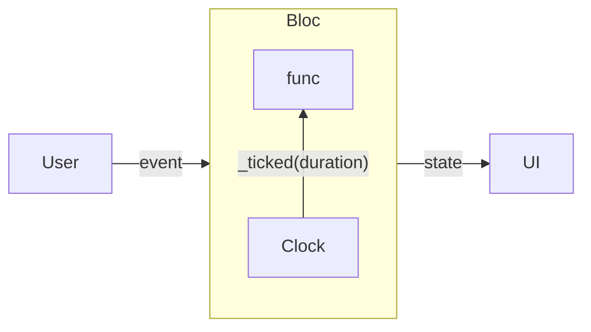

# flutter_timer

- web: https://bloclibrary.dev/tutorials/flutter-timer/
- source: https://github.com/felangel/bloc/tree/master/examples

## Bloc



将一个Clock内置在Bloc中触发内部事件`_ticked(duration)`

```
state = initial(duration)
      | runInProgress(duration)
      | runPause(duration)
      | runComplete(duration)
```

```
event = stated(duration)
      | paused 
      | resumed 
      | reset 
      | _ticked(duration)
```

```
bloc =
      | started -> runInProgress & _ticker.publish(_ticked)
      | paused  -> switch(state)
                    | runInProgress  -> runPause & _ticker.pause()
                    | _              -> state
      | resumed -> switch(state)
                    | runPause       -> runInProgress & _ticker.resume()
                    | _              -> state
      | reset   -> initial & _ticker.cancel()
      | _ticked -> duration > 0 
                    ? RunInProgress
                    : RunComplete
```

## 约束

