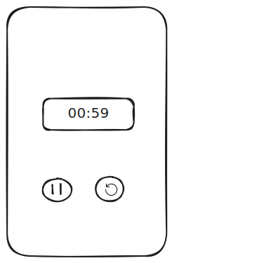
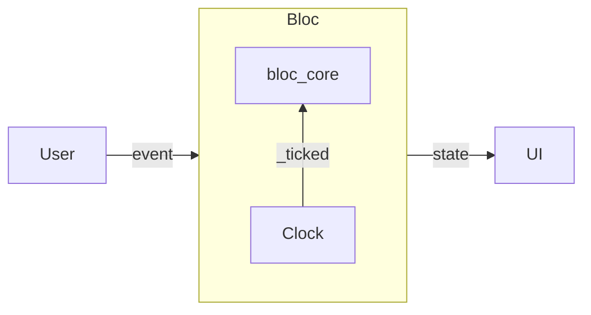

# flutter_timer

- web: https://bloclibrary.dev/tutorials/flutter-timer/
- source: https://github.com/felangel/bloc/tree/master/examples

## 业务



从用户的角度，有

```
event
  | stated(duration)
  | paused 
  | resumed 
  | reset
```

UI 的state有两个部分，一个是显示时间，一个是允许用户的操作，比如initial状态的时候是不会有pause 按钮的

```
state = initial(duration)
      | runInProgress(duration)
      | runPause(duration)
      | runComplete(duration)
```

bloc 角度，由于控制时间是一个 IO，需要剥离出来



因此调整 event 为

```
event
  | stated(duration)
  | paused 
  | resumed 
  | reset
  | _ticked(duration)
```

刚好 Clock 用一个计时流就可以表达

```
Ticker seconds = Stream.periodic(Duration(seconds: 1), (x) => x).take(seconds)
```

在此基础上，bloc 为

```
bloc <Ticker>
  | started -> runInProgress & _stream = react(Ticker(duration))
                                           | i -> _ticked(i)
  | paused  -> switch(state)
                 | runInProgress  -> runPause & _stream.pause()
                 | _              -> state
  | resumed -> switch(state)
                 | runPause       -> runInProgress & _stream.resume()
                 | _              -> state
  | reset   -> initial & _stream.cancel()
  | _ticked -> duration > 0 
                 ? RunInProgress
                 : RunComplete
```

action UI:

```
// play_arrow, pause 等为 icon
inital                   // 代码技巧：type changed
  play_arrow => Started  // buildWhen: prev.runtimeType != state.runtimeType
RunInProgress
  pause => Paused
  replay => Reset
RunPause
  play_arrow => Resumed
  replay => Reset
RunComplete
  replay => Reset
```

render UI

```
duration => xx:xx // 代码技巧：select duration
```

## 测试

测试 Clock

```
Clock 3 == [3, 2, 1]
```

测试 State：也就测 `==`

测试 Bloc

```
// 针对所有的
mock
  ticker.tick(ticks: 5) => <Stream>[5, 4, 3, 2, 1]

初始状态
  state == TimerInitial(60)

xxx
  _ --Started(5)--> RunInProgress [5, 4, 3, 2, 1]

  called ticker.tick(ticks: 5) == 1

xxx
  RunInProgress(2) --Paused()--> RunPause(2)


xxx
  _ --Reset--> TimerInitial(60)


xxx
  mock
    ticker.tick(ticks: 3) => <Stream>[3]
  
  _ --Started(3)--> RunInProgress [3]

xxx
  mock
    ticker.tick(ticks: 1) => <Stream>[1, 0]
  
  _ --Started(1)--> [RunInProgress(1), RunComplete(0)]
```

测试 UI

```
setUp
  mock timerBloc
tearDown
  reset(timerBloc)

初始状态
  mock
    state => TimerInitial(60)
  pumpWidget
  find.text('01:00')            // 确认显示
  find.byIcon(Icons.play_arrow) // 确认允许的按钮

测试状态 RunInProgress
  mock
    state => RunInProgress(59)
  pumpWidget
  find.text('00:59')                      // 确认显示
  find.byIcon(Icons.pause， Icons.replay) // 确认允许的按钮


同理测试其他状态，重点是允许的用户操作...

测试按下 play
  mock
    state => TimerInitial(60)
  pumpWidget
  tap(find.byIcon(Icons.play_arrow))
  called bloc.add(TimerStarted(60)) == 1 // 确认事件


同理测试其他按钮...

测试 duration 变化的时候，action 没有重建
  mock
    controller = proxy bloc RunInProgress(10) // 代理 bloc
  pumpWidget
  oriButton = find.PauseButton

  controller.add(RunInProgress(9))
  pump
  oriButton == find.PauseButton
```